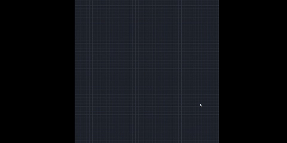
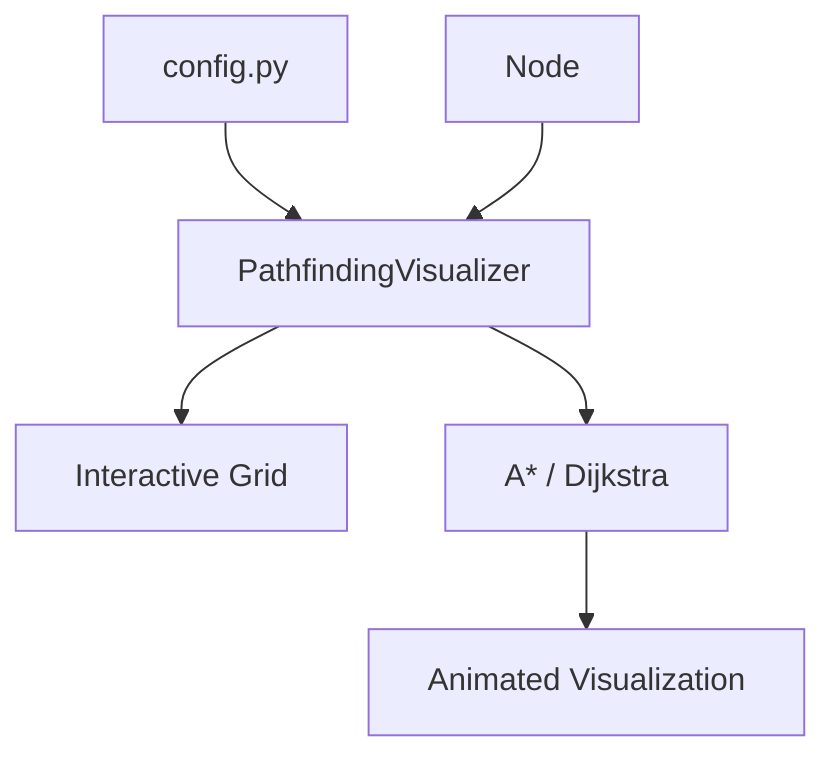

# Pathfinding Algorithm Visualizer 

[](https://www.python.org/)
[](https://www.pygame.org/)
[](LICENSE)
[]()

A modern, interactive Pathfinding Algorithm Visualizer developed in Python using Pygame, designed to demonstrate and compare the execution of A* (A-Star) and Dijkstra's Algorithm on customizable grid-based environments.

Users can design custom grid environments by placing start and goal nodes, drawing obstacles, and selecting either A* or Dijkstra's Algorithm to observe its behavior in real time. The application visualizes each stage of the search process, including frontier expansion, explored nodes, and the reconstructed shortest path, while reporting execution runtime and the number of explored nodes for algorithm comparison. This makes it a practical educational tool for understanding shortest-path algorithms and their performance characteristics.
<p align="center">
  
</p>

---

## 📖 Table of Contents
1. [Controls](#controls)
2. [Theoretical Background](#-theoretical-background)
3. [Algorithm Comparison](#-algorithm-comparison)
4. [Features](#-features)
5. [Project Structure](#-project-structure)
6. [Architecture](#architecture)
7. [Installation & Setup](#-installation--setup)
8. [Configuration Guide](#️-configuration-guide)
9. [Potential Enhancements](#-potential-enhancements)
10. [License](#-license)
---

<a id="controls"></a>
## 🕹️ Controls

| Input | Action |
|:------:|:-------|
| 🖱️ **Left Click** | Place the **Start Node**, then the **End Node**, followed by **Wall/Barrier** nodes. |
| 🖱️ **Right Click** | Reset the selected node to its default state. |
| ⌨️ <kbd>A</kbd> | Run  **A\*** Algorithm|
| ⌨️ <kbd>D</kbd> | Run **Dijkstra's Algorithm** |
| ⌨️ <kbd>C</kbd> | Clear the grid, removing all nodes, barriers, and previous search results. |

---

## 📐 Theoretical Background

The visualizer demonstrates the contrast between **Informed (Heuristic) Search** and **Uninformed Search** on a 2D grid network where each node connects up to 4 neighbors (orthogonal movement only).

### 1. A\* Algorithm (Informed Search)
The A\* algorithm determines the shortest path by evaluating nodes based on a combination of the actual distance from the starting node and an estimated distance to the target. It minimizes the total cost function:

$$f(n) = g(n) + h(n)$$

Where:
- **$g(n)$**: The exact cost of the path from the starting node to node $n$. On our uniform grid, each step represents a unit step cost of $+1$.
- **$h(n)$**: The heuristic function estimating the cost to reach the target from node $n$.
- **$f(n)$**: The total estimated cost of the cheapest path through node $n$.

#### Heuristic Metric: Manhattan Distance
Because diagonal movement is disabled in this grid implementation, the **Manhattan Distance** ($L_1$ Norm) is the mathematically optimal choice. It is both **admissible** (it never overestimates the actual cost to reach the goal) and **consistent** (satisfies the triangle inequality), guaranteeing that A\* will find the shortest path without unnecessary node re-evaluations:

$$h(n) = |x_n - x_{\text{goal}}| + |y_n - y_{\text{goal}}|$$

### 2. Dijkstra's Algorithm (Uninformed Search)
Dijkstra's Algorithm is a special case of A\* where the heuristic component is completely omitted ($h(n) = 0$). It evaluates nodes purely on their actual cumulative distance from the source:

$$f(n) = g(n)$$

Dijkstra's explores the grid uniformly in all directions, creating concentric wave-like patterns of "closed" nodes. While it guarantees the absolute shortest path, it does so at the cost of high spatial exploration, visiting significantly more nodes than A\*.

---

## 📊 Algorithm Comparison

| Metric | A\* (A-Star) Algorithm | Dijkstra's Algorithm |
| :--- | :--- | :--- |
| **Search Category** | Informed (Heuristic) Search | Uninformed (Non-Heuristic) Search |
| **Heuristic Function** | Manhattan Distance ($L_1$ Norm) | None ($h(n) = 0$) |
| **Time Complexity** | $O(E \log V)$ (with binary heap) | $O(E \log V)$ (with binary heap) |
| **Space Complexity** | $O(V)$ | $O(V)$ |
| **Exploration Style** | Directional, guided towards the target | Concentric radial expansion |
| **Optimality** | Guaranteed (with admissible heuristic) | Guaranteed for non-negative weights |
| **Nodes Explored** | Minimal (highly optimized spatial efficiency) | Maximal (exhaustively searches surrounding space) |

> While **A\*** and **Dijkstra's Algorithm** both have a worst-case time complexity of **$O(E \log V)$**, **A\*** typically performs significantly better in practice. Its heuristic guides the search toward the target, resulting in fewer explored nodes, lower execution time, and a more efficient search than Dijkstra's uninformed exploration.

## ✨ Features

- 🎮 **Interactive Grid Editing:** Place start and goal nodes, draw obstacles, and modify the grid in real time using intuitive mouse controls.

- ⚡ **Multiple Pathfinding Algorithms:** Visualize and compare the execution of **A\*** and **Dijkstra's Algorithm** on the same grid environment.

- 📊 **Performance Metrics:** Reports execution runtime and the total number of explored nodes after each search.

- 🎨 **Real-Time Visualization:** Animates frontier expansion, explored nodes, and the reconstructed shortest path as the algorithm executes.

- ⚙️ **Configurable Settings:** Customize grid size, frame rate, and the application's visual theme through a centralized configuration file.

---

## 📂 Project Structure

```text
pathfinding-visualizer/
│
├── assets/
│   └── demo.gif
│
├── src/
│   ├── main.py
│   └── config.py
│
├── README.md
├── requirements.txt
└── LICENSE
```

<a id="architecture"></a>
## 🏗️ Architecture

The project follows a modular, object-oriented architecture consisting of two primary modules:
- `config.py`: Stores application settings, including window configuration, visualization parameters, and color definitions.
- `main.py`: Implements the grid engine, user interaction, visualization logic, and the A* and Dijkstra pathfinding algorithms.

### Main Components:
1. **`Node` Class**: Encapsulates a grid cell's spatial attributes, current visual status, coordinate tracking, boundary neighbor validation, and rendering mechanics.
2. **`PathfindingVisualizer` Class**: The central coordinator containing the Pygame application loop, screen drawing pipelines, input handlers, coordinate transformations, and pathfinding solvers.

## 📥 Installation & Setup

Ensure you have **Python 3.8+** installed.

### 1. Clone the Repository

```bash
git clone https://github.com/rhthm/pathfinding-visualizer
cd pathfinding-visualizer
```

### 2. Install Dependencies

```bash
pip install -r requirements.txt
```

### 3. Run the Application

```bash
python src/main.py
```
---

## ⚙️ Configuration Guide

You can easily modify visual elements and grid scale by editing the properties in `config.py`:

```python
# window settings
WIDTH = 800          
ROWS = 50            
TARGET_FPS = 120

# color schemes 
DEFAULT_NODE_COLOR = (30, 34, 42)      
WALL_COLOR = (15, 17, 21)            
GRID_LINE_COLOR = (44, 50, 62)        
START_COLOR = (255, 110, 110)         
END_COLOR = (80, 250, 123)             
OPEN_SET_COLOR = (0, 150, 255)      
CLOSED_SET_COLOR = (40, 52, 74)       
PATH_COLOR = (189, 147, 249)         
```

---
## 💡 Potential Enhancements

- **Diagonal Movement:** Enable 8-directional traversal using **Octile** or **Chebyshev** distance heuristics.

- **Heuristic Options:** Support multiple heuristic functions (e.g., **Manhattan**, **Euclidean**, **Octile**) and implement **Greedy Best-First Search** for comparison.

- **Dynamic Weight Maps:** Transition the grid from binary states (walkable vs wall) to weighted terrains (e.g., mud, rough patches), forcing the algorithms to calculate complex cost gradients ($g(n)$ variations).

- **Maze Generation:** Implement automatic maze generation algorithms such as **Recursive Backtracking** and **Randomized Kruskal's Algorithm**.

- **Interactive UI Controls:** Add an on-screen control panel featuring **Start**, **Pause**, **Resume**, **Reset**, **Adjustable Grid Size**, **Animation Speed Slider**, **Theme Support**, and real-time statistics including **Execution Runtime**, **Path Length**, and **Explored Node Count**.

## 📄 License

This project is licensed under the MIT License - see the [LICENSE](LICENSE) file for details.

---

*Built by [rhthm](https://github.com/rhthm).*
